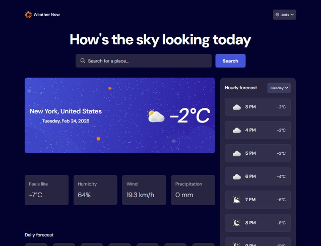
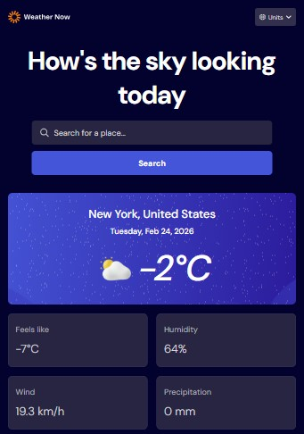

# Frontend Mentor - Weather app solution

A modern, sleek, and fully responsive weather forecast application. Built with React and Vite, this app leverages the Open-Meteo API to deliver precise and detailed weather data without requiring API keys.

This project is a solution to the Frontend Mentor Weather App challenge, designed with a strong focus on component architecture, state management, and User Experience (UX).

## ✨ Key Features
- Smart Search: Real-time location autocomplete with debouncing to optimize API usage.
- Real-time Data: Visualization of current weather, "feels like" temperature, humidity, wind, and precipitation.
- Detailed Forecasts:
    - 📅 Daily: High/Low summary for the next 7 days.
    - 🕒 Hourly: Interactive hourly breakdown, filterable by the selected day.
- Unit Management: Robust system to toggle between Metric/Imperial units (Celsius/Fahrenheit, km/h / mph, mm/in).
- Search History: Automatically saves recent searches using localStorage for quick access.
- Accessibility & Navigation: Full support for keyboard navigation across dropdowns and search lists.
- Responsive Design: Mobile-first interface built with strict CSS Modules and CSS Variables.
- UI States: Polished visual handling of loading states (Skeleton loading) and user-friendly error management.

## Table of contents

- [Overview](#overview)
  - [The challenge](#the-challenge)
  - [Screenshot](#screenshot)
  - [Links](#links)
- [My process](#my-process)
  - [Built with](#built-with)
  - [What I learned](#what-i-learned)
  - [Continued development](#continued-development)
- [Author](#author)


## Overview

### The challenge

Users should be able to:

- Search for weather information by entering a location in the search bar
- View current weather conditions including temperature, weather icon, and location details
- See additional weather metrics like "feels like" temperature, humidity percentage, wind speed, and precipitation amounts
- Browse a 7-day weather forecast with daily high/low temperatures and weather icons
- View an hourly forecast showing temperature changes throughout the day
- Switch between different days of the week using the day selector in the hourly forecast section
- Toggle between Imperial and Metric measurement units via the units dropdown 
- Switch between specific temperature units (Celsius and Fahrenheit) and measurement units for wind speed (km/h and mph) and precipitation (millimeters) via the units dropdown
- View the optimal layout for the interface depending on their device's screen size
- See hover and focus states for all interactive elements on the page

### Screenshot




### Links

- Solution URL: [Add solution URL here](https://your-solution-url.com)
- Live Site URL: [Add live site URL here](https://your-live-site-url.com)

## My process

### Built with

- Semantic HTML5 markup
- CSS custom properties
- Flexbox
- CSS Grid
- Mobile-first workflow
- [React](https://reactjs.org/) - JS library
- [Vite](https://vitejs.dev/) - Frontend Tooling
- CSS Modules - For scoped styles

### What I learned

I solidified my understanding of React basics by creating functional components, passing props from parents to children, and rendering lists using `map`. I implemented conditional rendering with ternary operators to handle various application states like loading, error, and successful data retrieval.

I gained practical experience with React hooks:
- `useState` for managing state for inputs, API data, and UI visibility.
- `useEffect` for handling side effects such as API calls, `setTimeout`, and browser events.

I also explored more advanced patterns like component composition using `props.children`. Perhaps the most valuable lesson was learning to effectively separate concerns within the application. I achieved this by isolating pure services (like API calls and localStorage management) from custom hooks, which then consume these services to expose a clean and easy-to-use API for the UI components.

```js
// Example of a custom hook consuming a service
const useWeather = (query) => {
  const [weather, setWeather] = useState(null);
  const [loading, setLoading] = useState(false);

  useEffect(() => {
    // Service call logic...
  }, [query]);

  return { weather, loading };
}
```

### Continued development

Now that I have mastered the basics of React and understand how to organize an application's architecture, my next step is to focus on learning navigation with React Router and everything that entails. I plan to delve deeper into client-side routing, nested routes, and managing complex navigation flows within single-page applications.

## Author

- Frontend Mentor - [@santiagodev10](https://www.frontendmentor.io/profile/@santiagodev10)
- Twitter - [@santiagoDev10](https://www.twitter.com/@santiagoDev10)